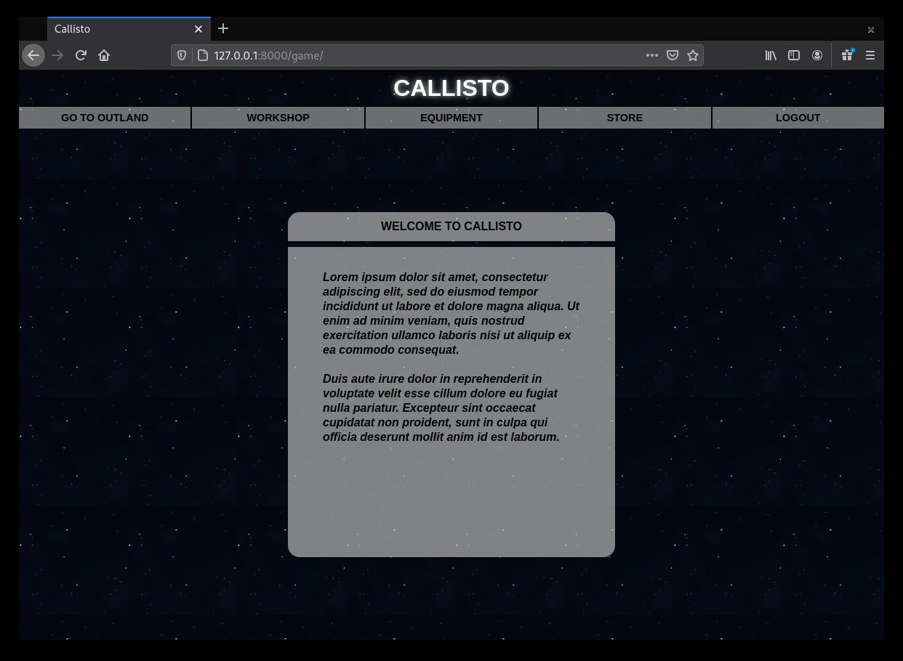
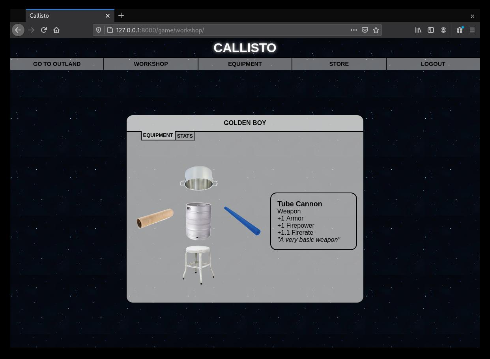
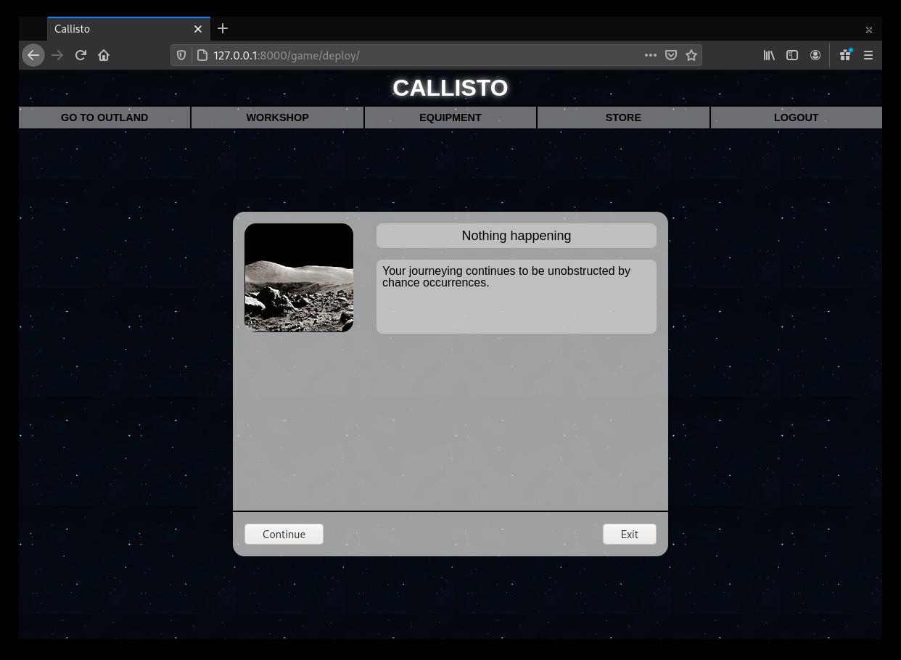

# Callisto

This project is a web based text based adventure game written using the [Django](https://www.djangoproject.com/) web framework. It utilizes many of Django's built in classes and functions to create a fully functional dynamic website with data persistence, user authentication, views and many other features.  It also utilizes the Fetcj API to retrieve JSON resources from the server which are then decoded and used to manipulate the DOM.

## Getting Started

These instructions will get you a copy of the project up and running on your local machine for development and testing purposes. See deployment for notes on how to deploy the project on a live system.

### Prerequisites

```
Python 3.X, Copyright 2001-2020, Python Software Foundation
Django 3.0.3, © 2005-2020 Django Software Foundation 
```

### Installing

You will need to have Python 3 installed on your machine.

Enter the following line into your command terminal to see which version of Python you have installed. Users of MacOS and Linux most likely already have some version of Python 3 on their machine. If not, please see installation instruction at [python.org](https://docs.python.org/3/).

```
python --version
```

You will also need to install Django (version 3.0 or higher):

```
pip install django
```

While inside of the project folder (the directory containing manage.py) run the following command to start the development server:

```
python manage.py runserver
```






## Deployment

For a comprehensive overview of how to deploy this, or any Django project, on [Heroku](https://www.heroku.com/) please see [this](https://developer.mozilla.org/en-US/docs/Learn/Server-side/Django/Deployment) tutorial

## Built With

* [Django](https://www.djangoproject.com/) - The web framework used
* [VSCode](https://code.visualstudio.com/) - Development environment
* [Git](https://git-scm.com/) - Version Control System

## Authors

* **N.T. Carruthers** - [GitHub](https://github.com/gif007)

See also the acknowledgements section

## License

This project is licensed under the MIT License - see the [LICENSE.md](LICENSE.md) file for details